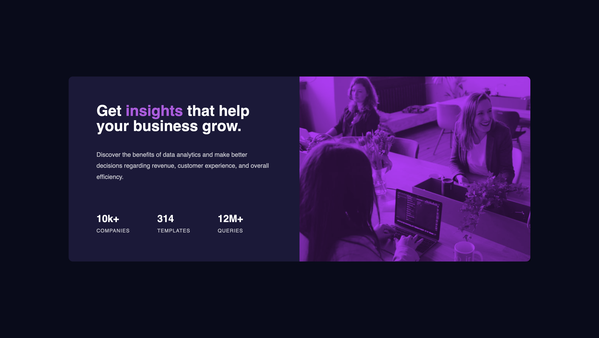

# Frontend Mentor - Stats preview card component solution

This is my solution to the [Stats preview card component challenge on Frontend Mentor](https://www.frontendmentor.io/challenges/stats-preview-card-component-8JqbgoU62). Frontend Mentor challenges help you improve your coding skills by building realistic projects. 

## Table of contents

- [Overview](#overview)
  - [Links](#links)
- [My process](#my-process)
  - [Built with](#built-with)
  - [What I learned](#what-i-learned)
  - [Continued development](#continued-development)
  - [Useful resources](#useful-resources)
- [Author](#author)

**Note: Delete this note and update the table of contents based on what sections you keep.**

## Overview

### The challenge

Users should be able to:

- View the optimal layout depending on their device's screen size

### Screenshot

### Links

- Live Site URL: [https://hungry-lamarr-7e39bd.netlify.app/](https://hungry-lamarr-7e39bd.netlify.app/)

## My process

### Built with

- Semantic HTML5 markup
- CSS custom properties
- Flexbox
- Mobile-first workflow
- A11y attributes

### What I learned

This was my first time working with the `srcset` and `sizes` html attributes, as well as the `mix-blend-mode` css property. Took awhile to understand and apply them correctly, but in the end I got there.

I've also started including a11y best pratices. I've just started learning about this and I'm feeling it out as I go.

### Continued development

   - More a11y.
   - Better undxerstanding of the `mix-blend-mode` property and its values/uses.

### Useful resources

- [srcset & sizes](https://www.youtube.com/watch?v=2QYpkrX2N48) - Really good explaination of the `srcset` and `sizes` html attributes.

## Author

- Frontend Mentor - [@TheFranMan](https://www.frontendmentor.io/profile/TheFranMan)
